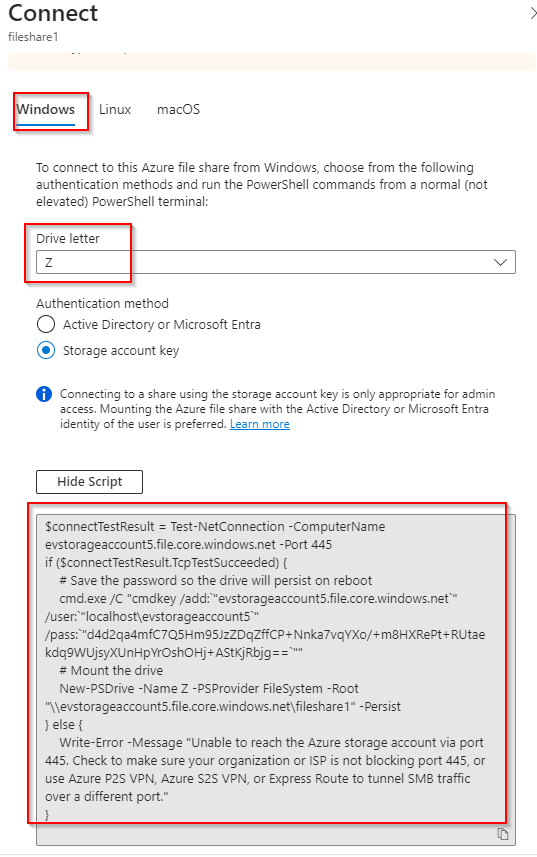

# Create and Restore File Share Snapshots in Azure

**There are 3 objectives with this lab:**
* Create a Storage Account and File Share
* Connect File Share to Windows VM
* Take a Snapshot and Restore Data
* 

## Create a Storage Account and File Share

Lets first create our storage account and a file share which we'll name `fileshare1`. So, search for storage account in the search bar. 

Once you find Storage accounts on the Azure Marketplace, click `+ Create`.

Give your storage account a unique name and click Create. 

Now, lets go into our storage account and under Data storage > File shares, we'll click `+ File share` to create our file share. 

Give your fileshare the name `fileshare1` and click Create.

That solves the first portion of our lab. On to the next objective. 

## Connect File Share to Windows VM

For the second portion of this lab, we need to connection our file share to the virtual machine (VM) in our resource group (RG). So, find the pre-configured VM named `winVM`. 

Once there, find `Connect` at the top of the page and choose the non-Bastion option as we don't even have Bastion configured. 

This should take you to a new page where you can download the RDP client. Very convenient because the download automatically uses the VM's public IP (PIP).

Once you download the file, click on the file in your Download directory. It should automatically pop up and just follow the prompt. Then, you'll be asked for a password. Use the password listed in the A Cloud Guru (ACG) lab page. You should then be connected to your VM. Once here, use the search bar to find the Windows Firewall. You'll need to go into the Windows Firewall Properties. 

Go and disable the firewall for the Domain Profile, Private Profile, and Public Profile. Make sure you press `Apply` for each tab and then press `Okay` to make sure everything is saved. 

Now, lets navigate back to the portal and choose the file share we created earlier. All the way to the right of the file share, click the three dots and you should see a `Connect` option. 

Here, make sure you have the Z: drive chosen and copy the PowerShell script that's provided. It should already have the correct operating system (OS) chosen for you. 

Go back to the VM and open up PowerShell. Copy and paste the script here and click enter. The commands should go through without any error messages. 

You should now be able to see the file share we created earlier in the File Explorer page. Pretty cool!

That's the end of the second objective. Lets finish this lab up. 

## Take a Snapshot and Restore Data

For our last objective, we want to make sure the Snapshot function is working. So first, we're going to create a file named `ACG.txt` and put `Hello Cloud Guru!` into that text file. We'll do this in the VM. 

Now, lets go back to the portal and navigate to our file share. On the left hand side, go to Operations > Snapshots. We're going to click on `+ Add snapshot` to get started. 

Follow the prompt and it should create a new snapshot for you. 

Lets click on that Snapshot and it should contain the `ACG.txt` file (which I wrongly named but don't pay attention to that). 

Now, lets go back to the VM and alter our original file. I added some additional text and saved the file as you can see below. 

Back in the portal, we can click on the ACG file to the right side and click `Restore`.

It will ask us if we want to give the restored file (original file) a new name. I gave it a new name (I also messed up here because I forgot to take a screenshot of the process). Click `OK`.

If you go back to your VM, you should have a new file with the name you just gave to the restored file. 

Once you click on the new file, it should have the original contents of ACG file which is exactly what a Snapshot does!

Lab completed!

## Personal Notes

Another straight forward lab. I was actually having some problems RDP'ing into the VM because I was getting a Zscaler block on my corporate computer. We got that worked out and everything else was fine here. Also, I need to make note that a .TXT file automatically appends .txt to a newly created file so I don't have to type it myself. 

